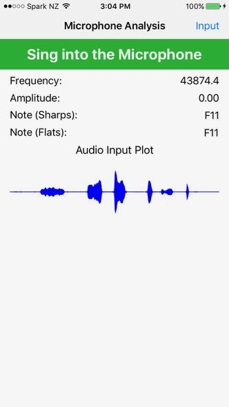
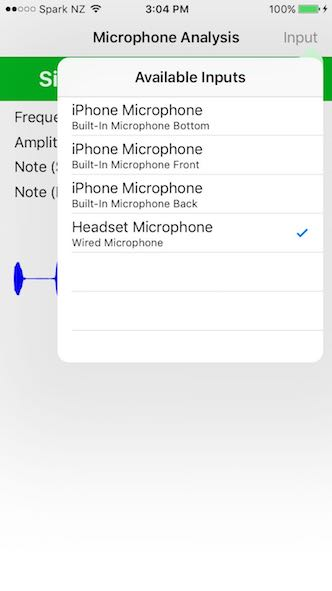

# Microphone Analysis

An example of using AKFrequencyTracker to get frequency and amplitude information from the incoming audio stream. The input is also plotted on a AKNodeOutputPlot, giving a visual representation of the input signal.

As an addded bonus, an example of how to switch input devices is given.

&nbsp;

&nbsp;&nbsp;&nbsp;&nbsp;&nbsp;&nbsp;

