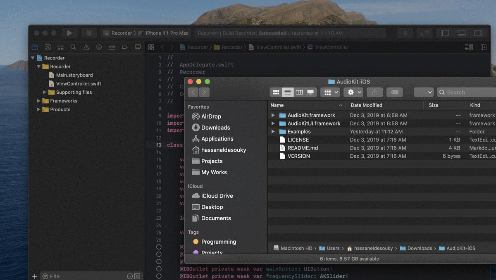

# AudioKit Frameworks

AudioKit is distributed as a couple of universal static frameworks with minimal dependencies on all supported platforms. This makes AudioKit easy to integrate within your own projects.

AudioKit requires at least iOS 9.0, macOS 10.11 (El Capitan) or tvOS 9.0. Your deployment target needs to be set to at least one of these versions to link with AudioKit.

## Using the compiled frameworks in your projects

* Select the target in your Xcode project that will link with AudioKit.
* Go to [AudoKit Downloads](https://audiokit.io/downloads/) and download the AudioKit-\*.zip archives that contain universal precompiled frameworks to be able to drag and drop them in the project folder.
* Drag and drop the `AudioKit.framework` bundle in the **Linked Frameworks and Libraries** section of the **General** tab.
* When prompted, select `Copy Items If Needed` (or, if you'd rather not copy the framework directly, you'll need to set your `Frameworks Search Path` correctly in the Build Settings tab).
* Repeat for `AudioKitUI.framework` if you are using the optional UI elements for your platform. 
* Make sure to add `-lc++` to the **Other Linker Flags** setting in your target.
* For **Objective-C Projects**, make sure that the *Embedded Content Contains Swift Code* build setting is set to YES for your target. AudioKit is a Swift library that depends on the Swift runtime being available.
* Also for **Objective-C Projects**, In your target settings make sure that **Swift 3 @objc inference** is set to `on`.
* For pure Objective-C projects (no Swift files), you will need to add this path to the library search paths of your target: `$(TOOLCHAIN_DIR)/usr/lib/swift/$(PLATFORM_NAME)`

## Alternative: include the AudioKit library from source

This may be the preferred method if you need to debug or develop code in AudioKit, as Xcode is still notoriously bad at handling precompiled Swift frameworks in other projects.

You may obtain the source code archive directly from [GitHub](https://github.com/AudioKit/AudioKit), or you may also clone the official repository.

* Drag and drop the `AudioKit For {platform}.xcodeproj` file to your project in Xcode. The file is located within the `AudioKit/{platform}` subdirectory in the repository, where `{platform}` is one of **iOS**, **macOS** or **tvOS**.
* You should be able to find `AudioKit.framework` and `AudioKitUI.framework` in the `AudioKit/{platform}/Products` folder. If this is not the case, build the frameworks by running `build_frameworks.sh`.
* In the **General** tab, add `AudioKit.framework` in **Frameworks, Libraries and Embedded Content** for your target. Also add `AudioKitUI.framework` as needed.
* Make sure to add `-lc++` to the **Other Linker Flags** setting in your target.
* For **Objective-C Projects**, In your target settings make sure that **Swift 3 @objc inference** is set to `on`.

## Building universal frameworks from scratch

If you are tinkering with AudioKit itself, you may also want to build a set of universal frameworks from source. We provide a script to do just that, which is how the actual binaries are produced for each new release of AudioKit.

Go to the `Frameworks` directory and run the `./build_frameworks.sh` script. You will need to have the Xcode command line tools installed. Optionally, install the `xcpretty` Ruby gem to prettify the ouput.

The built frameworks are dropped in the `Frameworks/AudioKit-{platform}` directory, where platform is one of iOS, tvOS or macOS. Note that when building from source, all included examples assume that the frameworks have been previously built in this location.

Optionally, you may restrict which platforms to build the frameworks for by setting the `PLATFORMS` environment variable prior to calling the script. The following example only builds for iOS and tvOS, skipping macOS:

`PLATFORMS="iOS tvOS" ./build_frameworks.sh`

## Universal XCFramework on Xcode 11 / Catalina

If you are running at least macOS 10.15 (Catalina), you can now build XCFramework archives containing all supported platforms in a singular archive - including the Mac Catalyst versions.

Note that these can only be built on a Mac running Catalina, and the `build_frameworks.sh` script only creates this if all platforms were built (the default), i.e. xcframework archives won't be generated if you're only building a subset of the platforms.

## Distribution to other projects

**Current this is only enabled for iOS, but it's easy for you to improve this for other targets** 

For people who want to build AudioKit in one directory then copy it into another project, there is an optional script, `distribute_built_frameworks.sh` that you can use to perform this copy at the end of `./build_frameworks.sh`.  

* First edit the example to copy the framework to your desired location:

    `pico distribute_built_frameworks.sh_example`
    
* Next move the example to enable the script:

    `mv distribute_built_frameworks.sh_example distribute_built_frameworks.sh`

Now, each time you run `./build_frameworks.sh`, it will copy the framework to your desired location.

`distribute_built_frameworks.sh` is in the .gitignore file so that you don't share your distribution process to other developers.
