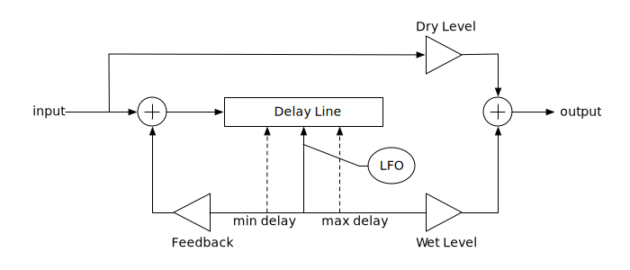

# Modulated Delay Effects

## Overview

Modulated-delay effects include **chorus**, **flanging**, and **vibrato**. These are all achieved by mixing an input signal with a delayed version of itself, and modulating the delay-time with a low-frequency oscillator (LFO).

The LFO's output (typically a sinusoid or triangle wave) sets the instantaneous delay-time (i.e., the position of the output tap along the  delay-line's length), which then varies cyclically between limits *min _delay* and *max_delay*, about a midpoint *mid_delay*.

The balance between the "dry" (input) signal and the "wet" (delayed) signal is usually set based on a user-selected fraction *wf* applied as a scaling factor (*Wet Level* in the diagram) on the wet signal, with the corresponding *Dry Level* set as *1.0 − f*, so there is no net gain.

A user-selected *Rate* parameter sets the LFO frequency, and a *Depth* parameter sets the difference between *max_delay* and *min_delay*.

For some effects, a fraction (indicated as *Feedback* in the diagram) of the delayed signal is fed back into the delay line.

## Chorus
For a chorus effect, the delay time varies about *mid_delay* which is fixed at the midpoint of the delay-line, whose total length is typically 20-40 ms. A user-selected *Depth* parameter controls how far *mid_delay* and *max_delay* deviate from this central value, from a minimum of zero (no change) to the point where *min_delay* becomes zero. No feedback is used.

In the **AKChorus** effect, *mid_delay* is fixed at 14 ms. Setting the *Depth* parameter to 1.0 (maximum) results in actual delay values of 14 ± 10 ms, i.e. *min_delay* = 4 ms, *max_delay* = 24 ms. The *Feedback* parameter will normally be left at the default value of 0, but can be set as high as 0.25. **AKChorus** uses a sine-wave LFO, range 0.1 Hz to 10.0 Hz.

## Flanger
For a flanging effect, *min_delay* is fixed at nearly zero, and the user-selected *Depth* parameter controls *max_delay*, from a minimum of zero to a maximum of about 7-10 ms. Typical settings include a 50/50 wet/dry mix, and at least some feedback.

The *Feedback* parameter is a signed fraction in the range -1.0 to + 1.0, where negative values indicate that the signal is inverted before begin fed back. This is important because when the delay time gets very close to zero, the low-frequency parts of the wet and dry signals overlap almost perfectly, so positive feedback can result in a sudden increase in volume. Using negative feedback instead yields a momentary reduction in volume, which is less noticeable.

In the **AKFlanger** effect, setting the *Depth* parameter to 1.0 results in *max_delay* = 10 ms. *Feedback* may vary from -0.95 to +0.95. LFO is a triangle wave, 0.1 - 10 Hz.

## Vibrato
With a modulated-delay effect in either chorus (*mid_delay* fixed at midpoint of delay-line) or flanger (*min_delay* fixed at near-zero) configuration, setting the *Wet Level* to 100% will yield a vibrato effect. This is due to the effect of the LFO modulating the delay time. When the delay-time is decreasing, the short fragment of sound in the delay-line is effectively resampled at a rate faster than its original sample rate, so the pitch rises. When the delay-time is increasing, the sound is resampled at a rate slower than its original sampling rate, so the pitch drops.

## Stereo Chorus and Flanging
Both **AKChorus** and **AKFlanger** are actually stereo effects. The DSP structure shown in the above diagram is duplicated for each of the Left and Right channels. The two LFOs run in lock-step at the same frequency (set by the *Rate* parameter) and amplitude (set by *Depth*), but offset in phase by 90 degrees. This technique, called *quadrature modulation*, is quite common in stereo modulation effects.

## For more information
Modulated-delay effects are described in detail in Chapter 10 of [Designing Audio Effect Plug-Ins in C++](https://www.amazon.com/Designing-Audio-Effect-Plug-Ins-Processing/dp/0240825152) by Will Pirkle.
